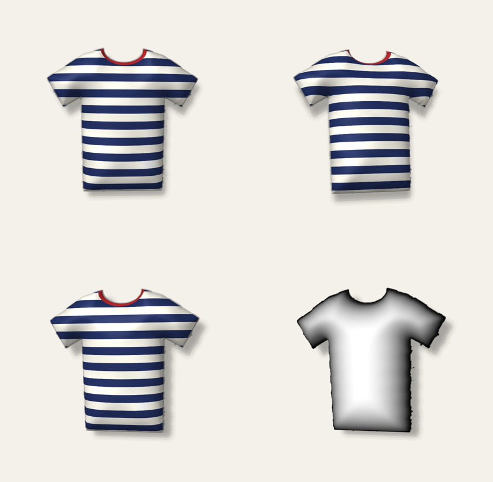

# Hangr

A closet app: photograph your clothes, and they appear as polished, "3D-ish"
items that tilt and catch the light as you move your phone. Then mix them into
outfits.



This repo currently holds the two prototypes that prove the core effect:

| Folder | What | Stack |
|---|---|---|
| [`pipeline/`](pipeline/README.md) | Photo → polished cutout + depth map | Python; OpenAI/Gemini image editing; BiRefNet + Depth Anything on a Modal GPU |
| [`app/`](app/) | The interactive tilt viewer | Expo (React Native) + raw WebGL via `expo-gl` |

## How the effect works

1. **Enhance**: an image-edit model turns the phone photo into a clean
   "ghost mannequin" product shot. A colour check compares it with the
   original photo and falls back to the original if the model changed the
   garment.
2. **Cutout**: background removal gives a transparent PNG, cropped and centred.
3. **Depth**: a depth map says how far each pixel bulges towards you.
4. **Viewer**: the app draws the cutout on a finely subdivided mesh, pushes
   each vertex forward by the depth map, lights it with normals derived from
   that depth, and drops a soft shadow on a card behind it. The phone's motion
   sensor (or a finger drag) tilts the mesh, so you see real parallax and the
   outline changes shape.

## Run the viewer

```bash
cd app
npm install
npx expo start          # press w for web, or scan the QR code with Expo Go
```

- **Phone (Expo Go):** tilt the phone, or drag the item.
- **Web:** drag the item. Browsers don't expose the motion sensor here, so
  the item sways gently on its own when idle.
- Use the **Depth** chips to compare Flat, Soft and Puffy, and
  **Show depth map** to see what the pipeline produced.

The bundled sample (`app/assets/sample/`) is the pipeline's output for a
synthetic T-shirt photo. See [`pipeline/README.md`](pipeline/README.md) to
process your own photos.

## Planned architecture

- **App:** Expo + TypeScript, built and shipped with EAS.
- **Backend:** Supabase (Postgres, Auth, Storage, Edge Functions). Images go
  in Storage and their paths in an `item_assets` table, so files can move to
  Cloudflare R2 later if download costs grow.
- **Processing:** an upload triggers an Edge Function, which calls the Modal
  GPU worker (`pipeline/modal_app.py`). The worker writes the assets back to
  Storage, and the app updates over Realtime.

## Next steps

1. Try the viewer on a real phone and tune the tilt direction, sensitivity and depth.
2. Run the Modal worker on real clothing photos and compare enhance providers.
3. Add Supabase: auth, the `items` / `item_assets` / `outfits` tables, and the upload → worker flow.
4. Build the closet grid and outfit builder around the viewer.
